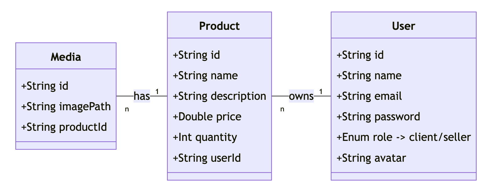

# Buy01 - E-commerce Microservices Platform



## 📋 Table des Matières
- [Vue d'ensemble](#vue-densemble)
- [Architecture](#architecture)
- [Technologies Utilisées](#technologies-utilisées)
- [Prérequis](#prérequis)
- [Installation et Démarrage](#installation-et-démarrage)
- [Configuration](#configuration)
- [Documentation API](#documentation-api)
- [Sécurité](#sécurité)
- [Tests](#tests)
- [Dépannage](#dépannage)
- [Variables d'environnement](#variables-denvironnement)
- [Frontend (Angular)](#frontend-angular)

## 🎯 Vue d'ensemble

Buy01 est une plateforme e-commerce complète construite avec une architecture microservices utilisant Spring Boot et Angular. La plateforme permet :

- **Inscription utilisateur** : Clients et Vendeurs avec upload d'avatar pour les vendeurs (max 2MB)
- **Authentification sécurisée** : JWT avec gestion des rôles et tokens internes
- **Gestion des produits** : CRUD exclusif aux vendeurs authentifiés
- **Gestion des médias** : Upload d'images avec validation (JPEG, PNG, WebP - max 2MB)
- **Communication inter-services** : Apache Kafka pour l'événementiel
- **Interface utilisateur** : Dashboard Angular responsive

## 🏗️ Architecture

### Microservices et Ports
```
📦 Buy01 Architecture
├── 🔍 Discovery Server (Eureka)     - Port 8761
├── 🚪 Gateway Service (HTTPS)       - Port 8443
├── 👥 User Service                  - Port 8081
├── 📦 Product Service               - Port 8082
├── 🖼️ Media Service                 - Port 8083
├── 🌐 Frontend (Angular)            - Port 4200
├── 📊 MongoDB User DB               - Port 27017 (user_db)
├── 📊 MongoDB Product DB            - Port 27018 (product_db)
├── 📊 MongoDB Media DB              - Port 27019 (media_db)
├── 🔄 Kafka Broker                  - Port 9092
└── 🐘 Zookeeper                     - Port 2181
```

### Communication
- **Service Discovery** : Netflix Eureka (Spring Cloud 2025.0.0)
- **API Gateway** : Spring Cloud Gateway avec SSL/HTTPS
- **Message Broker** : Apache Kafka 7.5.3 pour les événements inter-services
- **Base de données** : MongoDB séparée par service
- **Authentification** : JWT + tokens internes pour communication service-à-service

## 🛠️ Technologies Utilisées

### Backend
- **Spring Boot 3.5.3** (Java 17)
- **Spring Cloud 2025.0.0** (Eureka Client, Gateway)
- **Spring Security** + JWT (jjwt 0.11.5)
- **Spring Data MongoDB**
- **Apache Kafka** avec Zookeeper
- **Springdoc OpenAPI 2.7.0** (Swagger)
- **Bucket4j 7.6.0** (Rate Limiting)
- **Spring Validation**
- **Docker & Docker Compose**

### Infrastructure
- **MongoDB** (dernière version)
- **Confluent Kafka & Zookeeper**
- **SSL/HTTPS** avec certificats PKCS12

## 📋 Prérequis

- **Docker** et **Docker Compose**
- **Java 17** (pour développement local)
- **Maven 3.6+** (pour build des services)
- **mkcert** (pour certificats SSL en développement)
- **Node.js** (LTS version, e.g., 18.x or 20.x)
- **npm** (Node Package Manager, usually comes with Node.js)
- **Angular CLI** (`npm install -g @angular/cli`)

## 🚀 Installation et Démarrage


 **Cloner le repository**
```bash
git clone https://learn.zone01dakar.sn/git/preydedy/buy-01.git
cd buy01
```

### Option 1 : Démarrage avec Docker via script sh (Rapide)

1. **Modifier les droits d'exécutions des fichiers scripts**
```bash
chmod +x commit.sh run_microservice.sh start-project.sh stop-project.sh toggle-config.sh run-all-tests.sh
```

2. **Pour lancer le projet**
```bash
./start-project.sh
```

3. **Pour arrêter le projet**
```bash
./stop-project.sh
```

### Option 2 : Démarrage avec Docker manuel (Recommandé)

1. **Construire et démarrer tous les services**
```bash
docker-compose up --build
```

2. **Vérifier le démarrage des services**
```bash
# Eureka Dashboard
http://localhost:8761

# Gateway (HTTPS uniquement)
https://localhost:8443

# Documentation API centralisée
https://localhost:8443/swagger-ui.html
```

3. **Démarrer le frontend Angular**
```bash
cd frontend
npm install
npm run compodoc:serve
npm start
```

### Option 3 : Démarrage manuel (Développement)

**Démarrer les services Spring Boot via le Script**

```bash
./run_microservice.sh
```

## ⚙️ Configuration

### Configuration SSL/HTTPS

Le projet utilise **HTTPS obligatoire** via le Gateway Service. Le certificat est au format PKCS12.

#### Génération de certificat pour développement local

1. **Installer mkcert**
```bash
# Ubuntu/Debian
sudo apt install libnss3-tools mkcert

# macOS
brew install mkcert
```

2. **Créer et installer le certificat**
```bash
# Créer le certificat pour localhost
mkcert localhost

# Convertir en PKCS12
openssl pkcs12 -export \
  -in localhost.pem \
  -inkey localhost-key.pem \
  -out keystore.p12 \
  -name springboot \
  -password pass:changeit

# Déplacer dans les ressources du Gateway
mv keystore.p12 backend/api/gateway-service/src/main/resources/
```

### Bases de données MongoDB

Chaque service a sa propre base de données :

| Service | Database | Port | Container |
|---------|----------|------|-----------|
| User Service | `user_db` | 27017 | `user-mongodb` |
| Product Service | `product_db` | 27018 | `product-mongodb` |
| Media Service | `media_db` | 27019 | `media-mongodb` |

**Credentials** : `root` / `secret`

### Configuration Kafka

- **Bootstrap Servers** : `kafka:29092` (interne) / `localhost:9092` (externe)
- **Topics** : Auto-création activée
- **Consumer Groups** : 
  - `user-service-group`
  - `product-service-group` 
  - `media-service-group`

## 📚 Documentation API & Frontend(Angular)

### Swagger UI Centralisé
- **Gateway Swagger** : https://localhost:8443/swagger-ui.html
- Agrège tous les services : User, Product, Media

### Swagger par service (développement)
- **User Service** : http://localhost:8081/swagger-ui.html
- **Product Service** : http://localhost:8082/swagger-ui.html  
- **Media Service** : http://localhost:8083/swagger-ui.html

### Generate and serve frontend documentation  with hot-reload:
```bash
cd frontend
npm install
npm run compodoc:serve
```
#### After it, You'll able to see frontend doc on this link:


[http://localhost:8080/](http://localhost:8080/)


### Routes Gateway principales

| Route | Service de destination | Description |
|-------|----------------------|-------------|
| `/api/auth/**` | user-service | Authentification (avec rate limiting) |
| `/api/users/**` | user-service | Gestion utilisateurs |
| `/api/admin/**` | user-service | Administration |
| `/avatars/**` | user-service | Images avatars |
| `/api/products/**` | product-service | CRUD produits |
| `/api/media/**` | media-service | Upload/gestion médias |
| `/productsImages/**` | media-service | Images produits |

### Endpoints principaux

#### User Service (Port 8081)
```bash
POST   /api/auth/register     # Inscription (CLIENT/SELLER)
POST   /api/auth/login        # Connexion (retourne JWT)
GET    /api/users/me          # Profil utilisateur connecté
PUT    /api/users/me          # Mise à jour profil
POST   /api/users/avatar      # Upload avatar (SELLER)
GET    /avatars/{filename}    # Récupérer avatar
```

#### Product Service (Port 8082)
```bash
GET    /api/products          # Liste publique des produits
POST   /api/products          # Créer produit (SELLER uniquement)
GET    /api/products/{id}     # Détail produit
PUT    /api/products/{id}     # Modifier produit (propriétaire uniquement)
DELETE /api/products/{id}     # Supprimer produit (propriétaire uniquement)
```

#### Media Service (Port 8083)
```bash
POST   /api/media/upload      # Upload image produit (max 2MB, JPEG/PNG/WebP)
GET    /api/media/{id}        # Métadonnées image
GET    /productsImages/{filename} # Récupérer image
DELETE /api/media/{id}        # Supprimer image (propriétaire uniquement)
```

## 🛡️ Sécurité

### Mesures implémentées

- **HTTPS Obligatoire** : Toutes les communications via SSL/TLS
- **JWT Authentication** : Tokens avec expiration (1 heure)
- **Role-Based Access Control** : CLIENT vs SELLER
- **Tokens internes** : Communication service-à-service sécurisée
- **Password Hashing** : Spring Security avec BCrypt
- **File Validation** : 
  - Types autorisés : `image/jpeg`, `image/png`, `image/webp`
  - Taille max : 2MB par fichier, 10MB par requête
- **Rate Limiting** : Protection sur `/api/auth/**`
- **CORS Configuration** : Headers sécurisés

### Configuration JWT
```yaml
jwt:
  secret: N5Dztk+QsQEOFEhZ9WZ7ZzRp7uuOoT/knKWvYVZLNS7vt8BjnfHxLjzjGdBfEBu3
  expiration: 3600000  # 1 heure en millisecondes
```

### Token interne (service-to-service)
```yaml
internal:
  token-header: X-INTERNAL-TOKEN
  token: NyKKbcadVWq1Mim/r7vwzPjy0SikZgFOiYJRO8GvE1A=
```

## 🧪 Tests

### Tests automatisés
```bash
# User Service
cd backend/api/user && ./mvnw test

# Product Service  
cd backend/api/product && ./mvnw test

# Media Service
cd backend/api/media && ./mvnw test
```

### Tests manuels avec Swagger

1. **Authentification**
   - Inscription SELLER avec avatar
   - Login et récupération JWT
   - Test des accès basés sur les rôles

2. **Gestion produits**
   - Création par SELLER uniquement
   - Modification par propriétaire uniquement
   - Listing public accessible

3. **Upload médias**
   - Validation taille (rejet > 2MB)
   - Validation type (rejet non-image)
   - Association avec produits

## 🐛 Dépannage

### Problèmes courants

#### Services ne démarrent pas
```bash
# Vérifier les ports occupés
netstat -tulpn | grep -E ":(8761|8443|8081|8082|8083)"

# Nettoyer Docker complètement
docker-compose down -v
docker system prune -af
docker volume prune -f
```

#### Problèmes MongoDB
```bash
# Vérifier les logs MongoDB
docker logs user-mongodb
docker logs product-mongodb  
docker logs media-mongodb

# Accès direct aux bases
docker exec -it user-mongodb mongosh -u root -p secret
```

#### Erreurs SSL/HTTPS
```bash
# Vérifier le certificat
keytool -list -keystore backend/api/gateway-service/src/main/resources/keystore.p12 -storepass changeit

# Régénérer si nécessaire
rm backend/api/gateway-service/src/main/resources/keystore.p12
mkcert localhost
# Reconvertir...
```

#### Kafka non fonctionnel
```bash
# Redémarrer l'infrastructure Kafka
docker-compose restart zookeeper kafka

# Vérifier les topics
docker exec -it kafka kafka-topics --bootstrap-server localhost:9092 --list
```

#### Problèmes Eureka
```bash
# Vérifier l'enregistrement des services
curl http://localhost:8761/eureka/apps

# Logs Discovery Server
docker logs discovery-server
```

### Logs utiles
```bash
# Tous les services
docker-compose logs -f

# Service spécifique  
docker-compose logs -f user-service

# Suivre en temps réel
docker-compose logs -f --tail=100 gateway-service
```

## 🔧 Variables d'environnement

### Production
```env
# JWT
JWT_SECRET=votre-secret-jwt-tres-long-et-securise-minimum-256-bits

# MongoDB
MONGO_ROOT_PASSWORD=votre-mot-de-passe-securise

# Kafka
KAFKA_BOOTSTRAP_SERVERS=your-kafka-cluster:9092

# SSL
SSL_KEYSTORE_PASSWORD=votre-password-keystore

# Internal Services
INTERNAL_TOKEN=votre-token-interne-securise

# Eureka
EUREKA_DEFAULT_ZONE=http://your-eureka-server:8761/eureka
```

### Développement local
Les fichiers `application.properties` contiennent déjà les configurations pour Docker Compose avec commentaires pour le développement local.

## 📊 Monitoring et Health Checks

### Vérification des services
```bash
# Status des conteneurs
docker-compose ps

# Health check Eureka
curl http://localhost:8761/actuator/health

# Test Gateway
curl -k https://localhost:8443/actuator/health

# Services individuels  
curl http://localhost:8081/actuator/health # User
curl http://localhost:8082/actuator/health # Product
curl http://localhost:8083/actuator/health # Media
```

## 🤝 Contribution

1. Fork le projet
2. Créez votre branche feature (`git checkout -b feature/AmazingFeature`)
3. Committez vos changements (`git commit -m 'Add some AmazingFeature'`)
4. Push vers la branche (`git push origin feature/AmazingFeature`)
5. Ouvrez une Pull Request

## 📄 License

Ce projet est sous licence MIT - voir le fichier [LICENSE](LICENSE) pour plus de détails.

---

## 🌐 Frontend (Angular)

Le frontend de Buy01 est une application web réactive construite avec Angular, offrant une interface utilisateur intuitive pour les clients et les vendeurs.

### Technologies Clés
- **Angular** (dernière version stable)
- **TypeScript**
- **RxJS** pour la gestion des flux de données asynchrones
- **Angular Material** pour les composants UI (utilisé pour `MatButtonToggleModule`, `MatIconModule`, `MatDialogModule`)
- **HTML5 & CSS3** (avec SCSS pour le style)

### Fonctionnalités Principales
- **Authentification** : Inscription et connexion sécurisées avec gestion des rôles (Client/Vendeur).
- **Gestion de Profil** : Les utilisateurs peuvent consulter et mettre à jour leurs informations de profil, y compris l'avatar.
- **Liste de Produits** : Affichage des produits avec options de filtrage par catégorie, recherche et tri (par nom, prix, date).
- **Détails du Produit** : Vue détaillée de chaque produit avec images, description et informations sur le vendeur.
- **Gestion des Produits (Vendeur)** : Les vendeurs peuvent ajouter, modifier et supprimer leurs propres produits, y compris la gestion des images associées.
- **Notifications** : Système de messages (toasts) pour informer l'utilisateur des succès et des erreurs.

### Structure du Projet Frontend
```
frontend/
├── src/
│   ├── app/
│   │   ├── auth/                 # Composants d'authentification (sign-in, sign-up)
│   │   ├── error/                # Composants de gestion d'erreurs (toast-error)
│   │   ├── models/               # Interfaces TypeScript pour les données (User, Product, etc.)
│   │   ├── navbar/               # Composant de navigation
│   │   ├── products/             # Composants liés aux produits (list, card, circular-image)
│   │   ├── profile/              # Composants de gestion de profil (profile, update-form)
│   │   ├── seller/               # Composants spécifiques aux vendeurs (dashboard, form-product, product-management)
│   │   ├── services/             # Services Angular pour l'interaction avec les APIs (auth, user, product, api-url, guard, data)
│   │   ├── utils/                # Fonctions utilitaires (handleHttpError)
│   │   └── app.component.ts      # Composant racine de l'application
│   ├── assets/                   # Fichiers statiques (images, icônes)
│   ├── environments/             # Configurations d'environnement (dev, prod)
│   ├── styles.css                # Styles globaux de l'application
│   └── main.ts                   # Point d'entrée de l'application Angular
└── ... (autres fichiers de configuration Angular)
```

### Démarrage du Frontend
Assurez-vous d'avoir Node.js, npm et Angular CLI installés (voir [Prérequis](#prérequis)).

1.  **Naviguer vers le répertoire frontend**
    ```bash
    cd frontend
    ```
2.  **Installer les dépendances**
    ```bash
    npm install
    ```
3.  **Démarrer le serveur de développement**
    ```bash
    ng serve --open
    ```
    L'application sera accessible à `http://localhost:4200`. Elle se connectera automatiquement au Gateway Service sur `https://localhost:8443`.

### Configuration Spécifique
- **API Endpoint**: Le frontend est configuré pour communiquer avec le Gateway Service sur `https://localhost:8443`. Cette URL est définie dans `frontend/src/app/services/api-url-service.ts` et devrait être remplacée par une URL de production via les fichiers d'environnement (`environments/environment.prod.ts`) pour les déploiements en production.
- **Gestion des Images**: Les images d'avatar et de produits sont gérées via le Media Service. Les chemins d'accès aux images sont construits dynamiquement.

## 🚦 Status des Services

| Service | Status | Port | Health Check | Swagger |
|---------|--------|------|--------------|---------|
| Discovery Server | ✅ | 8761 | http://localhost:8761 | ❌ |
| Gateway Service | ✅ | 8443 | https://localhost:8443 | ✅ Centralisé |
| User Service | ✅ | 8081 | http://localhost:8081/actuator/health | http://localhost:8081/swagger-ui.html |
| Product Service | ✅ | 8082 | http://localhost:8082/actuator/health | http://localhost:8082/swagger-ui.html |
| Media Service | ✅ | 8083 | http://localhost:8083/actuator/health | http://localhost:8083/swagger-ui.html |
| Frontend | ✅ | 4200 | http://localhost:4200 | ❌ |

## 📁 Structure des volumes

```
./uploads/                    # Volume partagé
├── avatars/                  # User Service - Avatars utilisateurs
└── productsImages/           # Media Service - Images produits
```

**Auteur** : [preydedy](https://learn.zone01dakar.sn/git/preydedy/) et [cheikhmodiouf](https://learn.zone01dakar.sn/git/cheikhmodiouf/)

**Version** : 1.0.0  
**Spring Boot** : 3.5.3  
**Spring Cloud** : 2025.0.0  
**Dernière mise à jour** : Juillet 2025